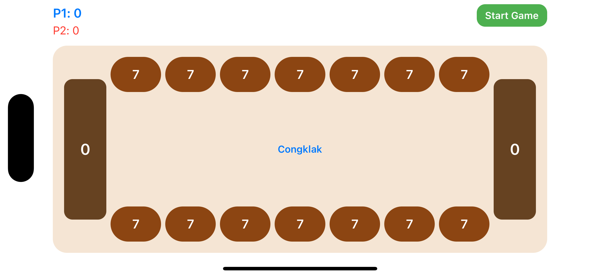
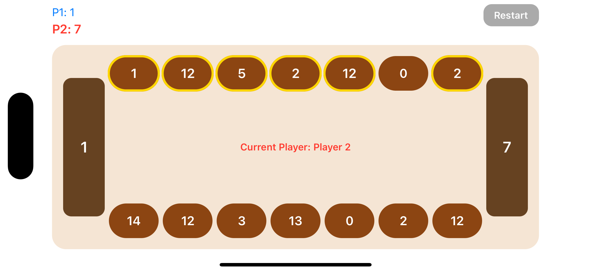
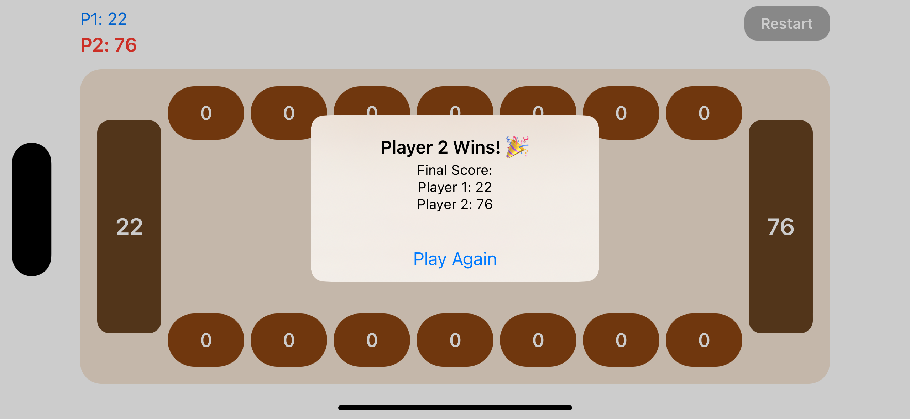

# 🎮 Congklak - Traditional Indonesian Board Game

An interactive iOS application that brings the traditional Indonesian mancala-style board game (Congklak) to iPhone. Built with UIKit, MVVM architecture, and Combine framework.


## 📱 Screenshots

<table>
  <tr>
    <td></td>
    <td></td>
    <td></td>
  </tr>
  <tr>
    <td align="center">Game Start</td>
    <td align="center">Gameplay</td>
    <td align="center">Game End</td>
  </tr>
</table>

## 🎯 Game Rules Summary

### Overview
Congklak is a traditional Indonesian game played by two players on a board with 16 pits. The objective is to collect the most stones in your store.

### Board Setup
- **16 pits total**: 
  - 7 small pits per player
  - 1 large pit (store) per player
- **Starting stones**: Each small pit starts with 7 stones (98 total)
- **Layout**:
  ```
  Player 2:  [Store] ← [7] [7] [7] [7] [7] [7] [7]
  Player 1:  [7] [7] [7] [7] [7] [7] [7] → [Store]
  ```

### How to Play

1. **Taking a Turn**
   - Select one of your pits that contains stones
   - Pick up all stones from that pit
   - Distribute stones counter-clockwise, one per pit

2. **Distribution Rules**
   - Place stones in your own pits and your store
   - **Skip opponent's store** (never place stones there)
   - Continue until all stones are distributed

3. **Extra Turn Rule** ⭐
   - If your last stone lands in **your own store**
   - You get an **extra turn**
   - Continue playing without switching players

4. **Capture Rule** 🎯
   - If your last stone lands in an **empty pit on your side**
   - AND the **opposite opponent's pit has stones**
   - Capture both your stone and all opponent's stones from opposite pit
   - All captured stones go to **your store**

5. **Game End**
   - Game ends when **all pits on one side are empty**
   - Remaining stones on the other side go to that player's store
   - **Player with most stones in store wins!**

### Example Turn

```
Initial:
Player 2: [0] ← [7] [7] [7] [7] [7] [7] [7]
Player 1: [7] [7] [7] [7] [7] [7] [7] → [0]

Player 1 selects pit with 7 stones:
Distributes to next 7 pits counter-clockwise

Result:
Player 2: [0] ← [8] [7] [7] [7] [7] [7] [7]
Player 1: [0] [8] [8] [8] [8] [8] [8] → [0]

Turn switches to Player 2
```

## 🏗️ Architecture Explanation

### MVVM Pattern

This project implements the **Model-View-ViewModel (MVVM)** architecture with Combine framework for reactive data binding.

```
┌──────────────────────────────────────────┐
│              View Layer                   │
│  ┌────────────────────────────────────┐  │
│  │     GameViewController              │  │
│  │  - Manages UI lifecycle             │  │
│  │  - Observes ViewModel via Combine   │  │
│  │  - Handles user interactions        │  │
│  └────────────────────────────────────┘  │
│          │                    ▲           │
│          │ Commands           │ Updates   │
│          ▼                    │           │
│  ┌────────────────────────────────────┐  │
│  │  Custom Views                      │  │
│  │  - PitView (individual pit)        │  │
│  │  - GameBoardView (complete board)  │  │
│  └────────────────────────────────────┘  │
└──────────────────────────────────────────┘
                │                  ▲
          Commands          @Published State
                ▼                  │
┌──────────────────────────────────────────┐
│           ViewModel Layer                 │
│  ┌────────────────────────────────────┐  │
│  │      GameViewModel                  │  │
│  │  - Business logic coordination      │  │
│  │  - State management (Combine)       │  │
│  │  - @Published properties            │  │
│  │  - Transforms data for UI           │  │
│  └────────────────────────────────────┘  │
└──────────────────────────────────────────┘
                │                  ▲
          Delegates           Returns
                ▼                  │
┌──────────────────────────────────────────┐
│            Service Layer                  │
│  ┌────────────────────────────────────┐  │
│  │        GameEngine                   │  │
│  │  - Pure game logic                  │  │
│  │  - Rule implementation              │  │
│  │  - No UI dependencies               │  │
│  │  - Protocol-based (testable)        │  │
│  └────────────────────────────────────┘  │
└──────────────────────────────────────────┘
                │                  ▲
          Modifies            Reads
                ▼                  │
┌──────────────────────────────────────────┐
│             Model Layer                   │
│  ┌────────────────────────────────────┐  │
│  │  GameBoard │ Pit │ Player          │  │
│  │  - Data structures                  │  │
│  │  - Business entities                │  │
│  │  - Value types (structs/enums)      │  │
│  └────────────────────────────────────┘  │
└──────────────────────────────────────────┘
```

### Component Details

#### 1. **Models** (`Models/`)
Pure data structures with no business logic:

- **`Player.swift`**: Enum representing players (`.one`, `.two`)
  - Provides opponent computation
  - Display name formatting

- **`Pit.swift`**: Struct representing a single pit
  - Properties: `stoneCount`, `isStore`, `owner`
  - Validation: `canBeSelected(by:)`

- **`GameBoard.swift`**: Struct representing the complete board
  - 16 pits array with index-based access
  - Helper methods for pit queries
  - Board layout:
    ```
    Index:  [0] [1-7]        [8-14] [15]
    Owner:  [P1] [P1 pits]   [P2 pits] [P2]
    Type:   Store  Small      Small   Store
    ```

#### 2. **Services** (`Services/`)

- **`GameEngine.swift`**: Core game logic implementation
  - **Protocol-based**: `GameEngineProtocol` for testability
  - **Key Methods**:
    - `performMove(from:)` → `MoveResult?`
    - `checkGameEnd()` → `Bool`
    - `determineWinner()` → `Player?`
  - **Algorithm**:
    ```
    1. Validate pit selection
    2. Distribute stones counter-clockwise
    3. Check extra turn (last stone in own store)
    4. Check capture (last stone in empty own pit)
    5. Switch turn if needed
    6. Return MoveResult with affected indices
    ```

#### 3. **ViewModels** (`ViewModels/`)

- **`GameViewModel.swift`**: Presentation logic with Combine
  - **@Published Properties**:
    - `gameBoard: GameBoard`
    - `currentPlayer: Player`
    - `gameStatus: GameStatus`
    - `statusMessage: String`
    - `animatingPitIndices: Set<Int>`
  
  - **User Actions**:
    - `startNewGame()`
    - `selectPit(at:)`
    - `resetGame()`
  
  - **UI Helpers**:
    - `shouldHighlightPit(at:)` → Bool
    - `score(for:)` → Int
    - `canSelectPit(at:)` → Bool

#### 4. **Views** (`Views/`)

**Custom Views**:

- **`PitView.swift`**: Individual pit representation
  - Circular/oval shape with stone count
  - Tap gesture handling
  - Highlight animations
  - Stone count change animations

- **`GameBoardView.swift`**: Complete board layout
  - 16 pit views arranged in two rows
  - 2 store views on sides
  - Delegate pattern for pit taps
  - Auto Layout for responsive sizing

**View Controller**:

- **`GameViewController.swift`**: Main game screen
  - Combine subscriptions to ViewModel
  - UI updates via reactive bindings
  - User interaction handling
  - Game end alert presentation

#### 5. **Utils** (`Utils/`)

- **`Constants.swift`**: Centralized constants
  - Colors (board, pits, highlights)
  - Sizes (pit dimensions, spacing)
  - Animation durations
  - Layout constants

### State Management Flow

```swift
// 1. User taps pit
pitView.onTap?() 

// 2. View notifies ViewController
delegate.didTapPit(at: index)

// 3. ViewController calls ViewModel
viewModel.selectPit(at: index)

// 4. ViewModel calls GameEngine
let result = gameEngine.performMove(from: index)

// 5. ViewModel updates @Published state
gameBoard = gameEngine.currentBoard
currentPlayer = gameEngine.currentPlayer

// 6. Combine notifies subscribers
viewModel.$gameBoard
    .sink { board in 
        updateBoardUI(board) 
    }

// 7. UI updates automatically
boardView.updateBoard(with: board)
```

### Why MVVM?

✅ **Separation of Concerns**: Clear boundaries between layers  
✅ **Testability**: Business logic isolated from UI  
✅ **Reusability**: ViewModels can work with different UIs  
✅ **Maintainability**: Easy to modify without breaking other layers  
✅ **Reactive**: Combine provides automatic UI updates  

## 🛠️ Technical Stack

| Component | Technology |
|-----------|-----------|
| Language | Swift 5+ |
| UI Framework | UIKit (Programmatic + Storyboard) |
| Architecture | MVVM |
| State Management | Combine Framework |
| Layout | Auto Layout (NSLayoutConstraint) |
| Minimum iOS | 15.0 |
| Testing | XCTest |
| Design Pattern | Protocol-Oriented Programming |

## 📦 Project Structure

```
CongklakGame/
├── App/
│   ├── AppDelegate.swift
│   └── SceneDelegate.swift
│
├── Models/
│   ├── Player.swift              # Player enum with opponent logic
│   ├── Pit.swift                 # Pit struct with validation
│   └── GameBoard.swift           # Board with 16 pits
│
├── Services/
│   └── GameEngine.swift          # Core game logic (93% tested)
│
├── ViewModels/
│   └── GameViewModel.swift       # Presentation logic + Combine
│
├── Views/
│   ├── Controllers/
│   │   └── GameViewController.swift
│   ├── CustomViews/
│   │   ├── PitView.swift         # Individual pit UI
│   │   └── GameBoardView.swift   # Complete board UI
│   └── Base.lproj/
│       └── Main.storyboard
│
├── Utils/
│   └── Constants.swift           # Colors, sizes, animations
│
└── Resources/
    ├── Assets.xcassets
    └── LaunchScreen.storyboard

Tests/
└── GameEngineTests.swift         # 46 unit tests, 93% coverage
```

## ✨ Features

### Core Features
- ✅ 16-pit Congklak board (7 small + 1 store per player)
- ✅ Player vs Player mode (pass-and-play)
- ✅ Turn-based gameplay
- ✅ Counter-clockwise stone distribution
- ✅ Extra turn rule (last stone in own store)
- ✅ Capture rule (last stone in empty pit)
- ✅ Win condition detection
- ✅ Game end screen with final scores

### UI/UX Features
- ✅ Visual pit highlighting for active player
- ✅ Real-time stone count display
- ✅ Smooth animations
- ✅ Responsive tap handling
- ✅ Status messages for game events
- ✅ Restart game functionality
- ✅ Winner announcement alert

### Technical Features
- ✅ MVVM architecture
- ✅ Combine for reactive state management
- ✅ Protocol-based abstractions
- ✅ Auto Layout for adaptive UI
- ✅ Support for iPhone SE to iPhone 15 Pro Max
- ✅ Portrait orientation
- ✅ Unit tests (46 tests, 93% coverage)

## 🧪 Testing

### Test Coverage

```
GameEngine.swift:    93% ✅ (Target: 90%)
Player.swift:       100% ✅
GameBoard.swift:    100% ✅
```

### Test Suite

46 comprehensive unit tests covering:

- ✅ Initial board setup
- ✅ Move validation (empty pits, opponent pits, stores)
- ✅ Stone distribution algorithm
- ✅ Extra turn rule
- ✅ Capture rule (all scenarios)
- ✅ Opposite pit calculation
- ✅ Game end detection
- ✅ Winner determination
- ✅ Stone conservation
- ✅ Edge cases

### Running Tests

```bash
# From Xcode
Cmd + U

# From terminal
xcodebuild test \
  -scheme CongklakGame \
  -destination 'platform=iOS Simulator,name=iPhone 15'
```

## 🎨 Design Decisions

### Color Scheme
- **Background**: Light beige (#F5E6D3) - mimics traditional wooden board
- **Pits**: Brown (#8B4513) - natural wood color
- **Stores**: Dark brown (#654321) - distinguished from small pits
- **Highlight**: Gold (#FFD700) - clear active state indication
- **Text**: White - high contrast on dark backgrounds

### Animation Strategy
- **Stone count changes**: Fade animations (0.3s)
- **Highlight**: Scale transform (1.0 → 1.05)
- **Tap feedback**: Bounce effect (0.2s)
- **Target**: 60 FPS smooth animations

### Layout Philosophy
- **Symmetric design**: Balanced visual weight
- **Touch targets**: Minimum 60x60 points (exceeds 44x44 guideline)
- **Spacing**: Consistent 8-point grid system
- **Responsiveness**: Auto Layout adapts to all iPhone sizes

## 📱 Device Support

### Tested On
- ✅ iPhone SE (2nd gen) - 4.7" display
- ✅ iPhone 13 - 6.1" display
- ✅ iPhone 15 Pro Max - 6.7" display

### iOS Versions
- Minimum: iOS 15.0
- Tested: iOS 15.0 - 17.5

### Orientation
- ✅ Portrait (primary)
- ⚠️ Landscape (not fully optimized)

## ⚠️ Known Limitations

### Current Limitations

1. **Single Device Only**
   - Designed for pass-and-play on one device
   - No online multiplayer
   - No network synchronization

2. **No Game Persistence**
   - Game state not saved between app launches
   - Closing app loses current game
   - No game history tracking

3. **Portrait-Optimized**
   - Landscape mode supported but not fully optimized
   - Some UI elements may not scale perfectly in landscape
   - Recommended to play in portrait

4. **No Undo Feature**
   - Cannot undo moves once made
   - No move history for review
   - Requires careful play

5. **No AI Opponent**
   - Only supports 2-player mode
   - No single-player mode
   - No difficulty levels

6. **Limited Accessibility**
   - VoiceOver support not implemented
   - No Dynamic Type support
   - Color-only state indicators (no patterns/shapes)

7. **No Sound Effects**
   - Silent gameplay
   - No audio feedback for actions
   - No background music

8. **No Customization**
   - Fixed color scheme
   - No theme options
   - Cannot change stone count or board size

### Planned Improvements

If given more time, the following enhancements would be implemented:

#### High Priority
- [ ] Game state persistence (UserDefaults/Core Data)
- [ ] Undo/Redo functionality
- [ ] Full VoiceOver accessibility support
- [ ] Sound effects and haptic feedback

#### Medium Priority
- [ ] AI opponent (easy, medium, hard)
- [ ] Game statistics tracking
- [ ] Move history with replay
- [ ] Landscape layout optimization
- [ ] iPad support with adaptive layout

#### Low Priority
- [ ] Theme customization
- [ ] Online multiplayer (Game Center)
- [ ] Tutorial/How to play screen
- [ ] Achievement system
- [ ] Leaderboards

### Technical Debt

- **GameViewModel coverage**: Currently 7.1%, could be improved with more ViewModel tests
- **UI testing**: No automated UI tests currently
- **Error handling**: Could be more robust with custom error types
- **Localization**: Currently English only, needs Indonesian support

## 🚀 Installation & Running

### Requirements
- macOS 12.0+
- Xcode 14.0+
- iOS 15.0+ device or simulator
- Swift 5.0+

### Steps

1. **Clone the repository**
   ```bash
   git clone https://github.com/irwancannadys/CongklakGame.git
   cd CongklakGame
   ```

2. **Open in Xcode**
   ```bash
   open CongklakGame.xcodeproj
   ```

3. **Select target device/simulator**
   - Choose any iPhone simulator or connected device
   - Recommended: iPhone 15 or iPhone 15 Pro Max

4. **Build and run**
   - Press `Cmd + R` or click the Play button
   - App will launch in simulator/device

5. **Run tests** (optional)
   ```bash
   # In Xcode
   Cmd + U
   
   # Or via terminal
   xcodebuild test -scheme CongklakGame \
     -destination 'platform=iOS Simulator,name=iPhone 15'
   ```

## 📖 How to Play

1. **Launch the app** - You'll see the game board with "Start Game" button
2. **Tap "Start Game"** - Game begins, Player 1 goes first
3. **Select a pit** - Tap any highlighted pit on your side (bottom row)
4. **Watch stones distribute** - Stones spread counter-clockwise automatically
5. **Follow the rules**:
   - Land in your store → Get extra turn! ⭐
   - Land in empty pit → Capture opposite stones! 🎯
6. **Keep playing** until one side is empty
7. **Winner announced** - Alert shows final scores
8. **Play again** - Tap "Play Again" or "Restart"

## 🎓 Learning Outcomes

This project demonstrates proficiency in:

- ✅ MVVM architecture implementation
- ✅ Combine framework for reactive programming
- ✅ Protocol-oriented programming
- ✅ Custom UIKit views and animations
- ✅ Auto Layout and responsive design
- ✅ Unit testing and code coverage
- ✅ Game logic and algorithms
- ✅ State management patterns
- ✅ Clean code principles (SOLID)
- ✅ Git workflow and version control

## 📄 License

This project is created for educational purposes as part of an iOS Engineer coding challenge.

## 👤 Author

**Irwan Cannadys**
- GitHub: [@irwancannadys](https://github.com/irwancannadys)

## 🙏 Acknowledgments

- Traditional Congklak game rules and Indonesian cultural heritage
- iOS development community
- Swift and UIKit documentation

---

**Built with ❤️ using Swift and UIKit**

*Last updated: January 29, 2026*
